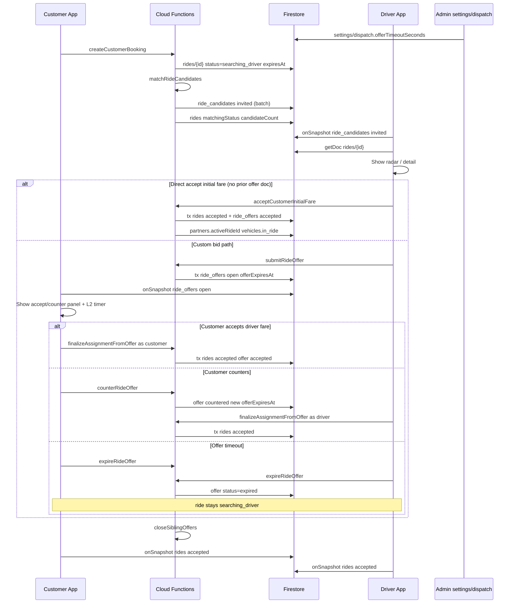
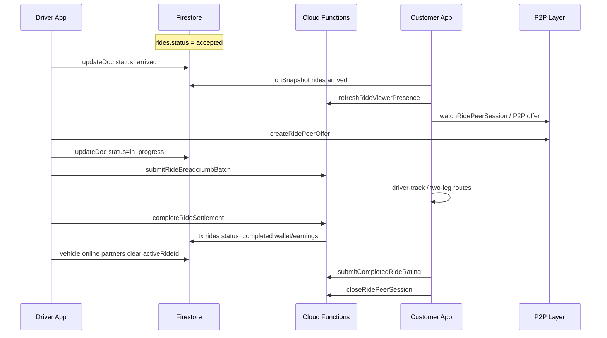
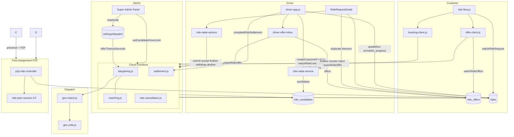

# Ride Assignment Architecture — Complete Audit

**Date:** 2026-08-06  
**Scope:** Entire SwiftGo monorepo (`F:/ride-app`)  
**Purpose:** Identify hidden assignment paths, duplicated logic, legacy code, and bypass routes before further changes.  
**Code changes:** None (audit only).

---

## 0. Status vocabulary (canonical vs user terms)

| User term | Canonical in codebase | Collection | Notes |
|-----------|----------------------|------------|-------|
| searching | `searching_driver` | `rides/{rideId}` | Active booking / dispatch |
| offered | `open` | `ride_offers/{rideId}_{driverId}` | Driver bid submitted; **not** a ride status |
| countered | `countered` | `ride_offers/...` | Customer counter; **not** a ride status |
| accepted / assigned | `accepted` | `rides/...` | Driver assigned; execution begins |
| arrived | `arrived` | `rides/...` | Client-only CF write (driver advances) |
| in_progress | `in_progress` | `rides/...` | Client-only CF write (driver starts trip) |
| completed | `completed` | `rides/...` | CF `completeRideSettlement` |
| cancelled | `cancelled_by_user`, `cancelled_by_customer`, `cancelled_by_admin`, … | `rides/...` | Multiple cancel reasons |
| search expired | `expired` | `rides/...` | 3-minute search timeout (not offer timeout) |
| offer expired | `expired` | `ride_offers/...` | P1-B `offer_timeout` |

**There is no ride status `offered`, `countered`, or `assigned`.** Negotiation lives on `ride_offers`. Assignment is `rides.status = accepted`.

---

## 1. Every file related to ride assignment

Classification: **Active** | **Legacy** | **Unused** | **Duplicate** | **Unknown**

### 1.1 Cloud Functions (`functions/`)

| File | Classification | Role |
|------|----------------|------|
| `functions/index.js` | **Active** | Callable exports; wires booking, matching, offers, assignment, settlement |
| `functions/bargaining.js` | **Active** | Core: create/cancel/expire booking, match, offers, assign, offer expiry (P1-B) |
| `functions/matching.js` | **Active** | Constants, candidate selection, progressive rings, eligibility |
| `functions/ride-cancellation.js` | **Active** | Decline, withdraw, driver pre-start cancel→rematch, admin cancel |
| `functions/geo-match.js` | **Active** | Geo-scoped driver discovery for `matchRideCandidates` |
| `functions/geo-cells.js` | **Active** | Grid cells, `STALE_LOCATION_MS` |
| `functions/geo-coverage.js` | **Active** | Ops geo coverage report |
| `functions/dispatch-latency.js` | **Active** | `withDispatchTimeout(15000ms)` wrapper |
| `functions/driver-location.js` | **Active** | Seed/mirror driver GPS on assignment |
| `functions/active-ride-reconcile.js` | **Active** | Heal stale `activeRideId`; availability checks |
| `functions/settlement.js` | **Active** | `completeRideSettlement` → `rides.status = completed` |
| `functions/partial-fare.js` | **Active** | In-progress cancel fare math |
| `functions/pricing-fare.js` | **Active** | Vehicle rate for cancel billing |
| `functions/pin-link.js` | **Active** | Blocks PIN link if genuine active ride |
| `functions/breadcrumb-batch.js` | **Active** | In-progress breadcrumb upload; validates assignment token |
| `functions/breadcrumb-schema.js` | **Active** | Assignment session token schema |
| `functions/ride-peer-session.js` | **Active** | P2P signaling post-assignment (`accepted`/`arrived`/`in_progress`) |
| `functions/ride-viewer-presence.js` | **Active** | Customer presence lease on trackable rides |
| `functions/ride-rating.js` | **Active** | Rating after `completed` |
| `functions/live-location-envelope.js` | **Active** | GPS accept/reject gates for mirror |
| `functions/ops-monitor.js` | **Active** | Matching/settlement failure metrics |
| `functions/admin-claims.js` | **Legacy** | Admin bootstrap (not assignment) |
| `functions/pin-security.js` | **Active** | PIN security (blocks link during active ride) |
| `functions/account-deletion.js` | **Active** | Account deletion (may reference rides) |

### 1.2 Customer app (`customer-app/js/`)

| File | Classification | Role |
|------|----------------|------|
| `ride-flow.js` | **Active** | Main booking UI, search timers, offer panel, ride lifecycle |
| `offer-client.js` | **Active** | Offer watch, finalize/counter/reject/expire CF calls |
| `booking-client.js` | **Active** | create/cancel/expire searching booking CFs |
| `booking-gate.js` | **Active** | Pre-book gate; queries active `rides` |
| `data.js` | **Mixed** | **Active:** `watchRideRequest`; **Legacy:** `bookings` collection, stub offer functions |
| `ride-status.js` | **Active** | Status constants aligned with `matching.js` |
| `history.js` | **Active** | Ride history listener; cancel active booking |
| `app.js` | **Active** | Boots app; calls `startRideRequest` |
| `dispatch-latency.js` | **Active** | T1–T4 timing marks |
| `driver-track.js` | **Active** | Post-assignment map tracking UI |
| `tracking-target.mjs` | **Active** | UI mode from ride status |
| `ride-view-lifecycle.mjs` | **Active** | Bind/unbind live ride view |
| `viewer-presence-client.mjs` | **Active** | Presence heartbeat post-assignment |
| `p2p-ride-controller.mjs` | **Active** | P2P session when trackable |
| `p2p-signaling-client.mjs` | **Active** | Watches `ride_peer_sessions` |
| `p2p-protocol.mjs` | **Active** | Trackable status set |
| `confirm-dialog.js` | **Active** | Extra booking confirm |
| `cancel-reason-dialog.js` | **Active** | Cancel while searching |
| `sheet.js` | **Active** | Uses `isSearchingDriver` from ride-flow |
| `fare.js` | **Active** | `#bookingSheet` DOM only |
| `i18n.js` | **Active** | Offer/booking strings |
| `firebase.js` | **Active** | Firebase init |
| `firebase-config.js` | **Active** | Project config |
| `screens.js` | **Unknown** | Screen routing (may reference ride screens) |
| `dashboard.js` | **Unknown** | Dashboard (peripheral) |
| `map.js` | **Active** | Map; reads `in_progress` for UI |
| `location.js` | **Unknown** | Location helpers |
| `routing.js` | **Active** | Route display (not assignment) |
| `two-leg-route-controller.mjs` | **Active** | Post-assignment route layers |
| `two-leg-route-layers.mjs` | **Active** | Post-assignment map layers |
| `display-location-pipeline.mjs` | **Active** | Live location render pipeline |
| `live-location-render.mjs` | **Active** | Post-assignment marker motion |
| `live-location-source-arbiter.mjs` | **Active** | P2P vs Firestore location source |
| `phase1-billing-diagnostics.mjs` | **Active** | Field diagnostics (not assignment logic) |
| `phase2-runtime-verification.mjs` | **Active** | Runtime verification hooks |
| `phase3-billing-proof.mjs` | **Active** | Billing proof hooks |
| `field-diagnostics.mjs` | **Active** | Diagnostics |
| `diagnostics-screen.js` | **Active** | Diagnostics UI |
| `diagnostics-screen-core.mjs` | **Active** | Diagnostics core |
| `e2e-hooks.js` | **Active** | E2E test hooks |
| `native-shell.js` | **Unknown** | Native shell bridge |
| `trust.js` | **Unknown** | Trust UI |
| `support.js` | **Unknown** | Support (may include rideId) |
| `utility-drawer.js` | **Active** | Comment re booking |
| `rate-details-modal.js` | **Active** | Fare display (pre-book) |
| `rate-details-view.js` | **Active** | Fare display |
| `step-ui.js` | **Unknown** | Step UI |
| `a11y.js` | **Active** | Accessibility |
| `auth.js` | **Active** | Auth (gate for all flows) |
| P2P comm modules (`p2p-comm-*.mjs`) | **Active** | Post-assignment comm (parallel to assignment) |
| `p2p-peer-session.mjs` | **Active** | WebRTC session |
| `p2p-location-envelope.mjs` | **Active** | P2P location envelopes |
| `p2p-pipeline-trace.mjs` | **Active** | Pipeline trace |
| `route-provider-bootstrap.mjs` | **Active** | Route provider init |
| `road-route-provider.mjs` | **Active** | Road routing |
| `route-geometry.mjs` | **Active** | Route geometry |
| `route-motion-controller.mjs` | **Active** | Marker motion |
| `route-progress.mjs` | **Active** | Route progress |
| `route-projection.mjs` | **Active** | Route projection |
| `marker-heading.mjs` | **Active** | Marker heading |
| `geometry-quality.mjs` | **Active** | Geometry quality |
| `off-route-detector.mjs` | **Active** | Off-route detection |
| `location-checkpoint-policy.mjs` | **Duplicate** | Copy in customer-app (shared canonical in shared/js) |
| `breadcrumb-schema.mjs` | **Active** | Breadcrumb schema |

### 1.3 Driver app (`driver-app/js/`)

| File | Classification | Role |
|------|----------------|------|
| `driver-app.js` | **Active** | Shell, radar feed, offer inbox, active ride, legacy incoming sheet (disabled) |
| `ride-radar-actions.js` | **Active** | All assignment CF wrappers |
| `ride-radar-controller.js` | **Active** | List ↔ detail coordinator |
| `ride-radar-service.js` | **Active** | `ride_candidates` → `rides` fetch |
| `AvailableRidesList.js` | **Active** | Radar list UI + **duplicate** candidate subscription |
| `RideRequestDetail.js` | **Active** | Detail UI, offer/ride listeners, bid/accept |
| `driver-offer-inbox.js` | **Active** | L1 offer inbox + expire timers |
| `DriverHome.js` | **Active** | Home / online toggle |
| `dispatch-latency.js` | **Active** | T3 marks |
| `ride-radar-model.js` | **Active** | Types; `ride_requests` archive path |
| `ride-radar-routing.js` | **Active** | Route preview (not assignment) |
| `settlement-client.js` | **Active** | `completeRideSettlement` |
| `driver-active-route.mjs` | **Active** | Post-assignment navigation |
| `active-ride-reconcile.mjs` | **Active** | Heal active ride pointers client-side |
| `location-checkpoint-policy.mjs` | **Active** | Status-driven location gates |
| `breadcrumb-collector.mjs` | **Active** | `in_progress` GPS breadcrumbs |
| `breadcrumb-uploader.mjs` | **Active** | Upload breadcrumbs CF |
| `bargain-capacity.js` | **Unused** | Duplicate `ride_offers` query; **not imported** |
| `firebase.js` | **Active** | Firebase init |
| `firebase-config.js` | **Active** | Config |
| `pin-link-client.js` | **Active** | Vehicle PIN link |
| `earnings-service.js` | **Active** | Reads assigned rides |
| `driver-dashboard.js` | **Active** | Stats from rides |
| `wallet.js` | **Active** | Wallet (post-settlement) |
| `home-service.js` | **Unknown** | Home services |
| `pricing-client.js` | **Active** | Pricing read |
| `rate-details-modal.js` | **Active** | Rate details |
| `i18n.js` | **Active** | Strings |
| `audio-service.js` | **Active** | Alert on new candidate (radar) |
| `fresh-location.mjs` | **Active** | Fresh location for dispatch |
| `location-write-queue.mjs` | **Active** | Vehicle location writes |
| `location-envelope.mjs` | **Active** | Location envelope |
| `viewer-presence-consumer.mjs` | **Active** | Consumes customer presence |
| `p2p-ride-controller.mjs` | **Active** | P2P post-assignment |
| `p2p-signaling-client.mjs` | **Active** | P2P signaling |
| `p2p-protocol.mjs` | **Active** | Trackable statuses |
| All other `p2p-*`, route, diagnostics modules | **Active** | Post-assignment / parallel systems |
| `local-first-cache.js` | **Unknown** | Cache |
| `online-readiness-diag.mjs` | **Active** | Online readiness |
| `EarningsDetail.js` | **Active** | Earnings UI |
| `trust.js` | **Unknown** | Trust |
| `a11y.js` | **Active** | A11y |
| `native-shell.js` | **Unknown** | Native shell |

### 1.4 Owner app (`owner-app/js/`)

| File | Classification | Role |
|------|----------------|------|
| `owner-app.js` | **Legacy / Duplicate** | **Parallel driver shell** with `startRideListener` (global searching query), `resolveActiveRequest` (client assign), `advanceActiveRideStatus` |
| `settlement-client.js` | **Active** | Settlement CF |
| `a11y.js` | **Active** | A11y |

### 1.5 Super Admin (`super-admin-panel/js/`)

| File | Classification | Role |
|------|----------------|------|
| `admin-app.js` | **Active** | Dispatch settings UI (`offerTimeoutSeconds`, candidate limit, radius) |
| `admin-settings-client.js` | **Active** | `setCandidateDriverLimit` CF |
| `fleet-map.js` | **Active** | Fleet map (not ride_candidates) |
| `firebase.js` | **Active** | Firebase init |

### 1.6 Shared (`shared/js/`)

| File | Classification | Role |
|------|----------------|------|
| `breadcrumb-schema.mjs` | **Active** | Breadcrumb + assignment token |
| `display-location-pipeline.mjs` | **Active** | Location pipeline post-assignment |
| `two-leg-route-controller.mjs` | **Active** | Two-leg routes post-assignment |
| `two-leg-route-layers.mjs` | **Active** | Map layers |
| All P2P/route/diagnostics copies | **Duplicate** | Mirrored into app `js/` via build |

### 1.7 Firestore rules & indexes

| File | Classification | Role |
|------|----------------|------|
| `firestore.rules` | **Active** | Client write policy for rides/offers/candidates |
| `firestore.indexes.json` | **Active** | Composite indexes for queries |

### 1.8 Tests (assignment-related)

| File | Classification | Role |
|------|----------------|------|
| `tests/p1b-auto-expire-suite.mjs` | **Active** | P1-B offer expiry lab |
| `tests/dispatch-booking-radar-e2e.mjs` | **Active** | Booking→radar E2E |
| `tests/dispatch-readiness-race.mjs` | **Active** | Dispatch race tests |
| `tests/booking-false-success-suite.mjs` | **Active** | False success guards |
| `tests/booking-driver-reach-suite.mjs` | **Active** | Driver reach |
| `tests/phase2a-emulator-suite.mjs` | **Active** | Phase 2A bargaining |
| `tests/phase2b-security-suite.mjs` | **Active** | Security |
| `tests/phase2d-functions-runtime.mjs` | **Active** | CF runtime |
| `tests/phase2e-four-app-browser.mjs` | **Active** | Four-app browser |
| `tests/phase3a-per-ride-measurement.mjs` | **Active** | Ops measurement |
| `tests/phase3b-geo-matching.mjs` | **Active** | Geo matching |
| `tests/customer-marker-motion-continuity.mjs` | **Active** | Post-assignment motion |
| `tests/runtime-consistency.mjs` | **Active** | Runtime consistency |
| `tests/emergency-fix-verification.mjs` | **Active** | Emergency verification |
| `tests/audit.test.mjs` | **Active** | Repo audit |

### 1.9 Deploy artifacts

| Path | Classification | Role |
|------|----------------|------|
| `hosting-dist/**` | **Duplicate** | Built copy of all app JS (must match source after deploy) |
| `F:/ride-app-p1a-validate/functions/**` | **Duplicate** | Validation fork (same architecture; minor deltas) |

### 1.10 Docs (assignment specs)

| File | Classification |
|------|----------------|
| `docs/specs/phase1-phase2-P1B-*` | **Active** |
| `docs/specs/RIDE-ASSIGNMENT-ARCHITECTURE-AUDIT.md` | **Active** (this document) |
| `docs/PHASE-5-ROAD-SNAPPING.md` | **Active** (post-assignment routing) |

---

## 2. Every Cloud Function involved

| Export | File | Classification | Assignment role |
|--------|------|----------------|-----------------|
| `createCustomerBooking` | index.js:225 | **Active** | Creates `rides` `searching_driver`; auto `matchRideCandidates` |
| `checkCustomerBookingGate` | index.js:195 | **Active** | Gate + reconcile expire |
| `matchRideCandidates` | index.js:469 | **Active** | Writes `ride_candidates`; updates ride matching metadata |
| `submitRideOffer` | index.js:513 | **Active** | Creates/updates `ride_offers` `open` |
| `counterRideOffer` | index.js:530 | **Active** | `ride_offers` → `countered`; refreshes `offerExpiresAt` |
| `rejectRideOffer` | index.js:543 | **Active** | `ride_offers` → `rejected` or `expired` |
| `declineRideCandidate` | index.js:556 | **Active** | `ride_candidates` → `declined` |
| `withdrawRideOffer` | index.js:569 | **Active** | `ride_offers` → `withdrawn` |
| `finalizeAssignmentFromOffer` | index.js:630 | **Active** | **Primary assign:** `rides` → `accepted`, offer → `accepted` |
| `acceptCustomerInitialFare` | index.js:645 | **Active** | **Direct assign** (no prior custom offer doc) |
| `expireRideOffer` | index.js:441 | **Active** | Single offer → `expired` (client timer) |
| `expireDueRideOffers` | index.js:423 | **Active** | Admin batch offer sweeper |
| `expireSearchingBooking` | index.js:388 | **Active** | Ride search → `expired` (3 min) |
| `expireDueSearchingBookings` | index.js:405 | **Active** | Admin batch search sweeper |
| `cancelCustomerBooking` | index.js:360 | **Active** | Cancel ride (pre-start or in-progress partial) |
| `cancelAllSearchingBookings` | index.js:207 | **Active** | Bulk cancel searching |
| `cancelAssignedRideByDriver` | index.js:585 | **Active** | Unassign → `searching_driver` + rematch |
| `cancelRideByAdmin` | index.js:600 | **Active** | Admin cancel |
| `previewCancellationFare` | index.js:375 | **Active** | Preview only |
| `completeRideSettlement` | index.js:124 | **Active** | `rides` → `completed` |
| `setCandidateDriverLimit` | index.js:662 | **Active** | Admin dispatch settings incl. `offerTimeoutSeconds` |
| `getDispatchSettings` | index.js:879 | **Active** | Read settings |
| `mirrorDriverLocationOnVehicleUpdate` | index.js:920 | **Active** | GPS mirror + optional rematch trigger |
| `refreshRideViewerPresence` | index.js:1003 | **Active** | Post-assignment presence |
| `createRidePeerOffer` | index.js:1016 | **Active** | P2P (post-assignment) |
| `publishRidePeerAnswer` | index.js:1032 | **Active** | P2P |
| `closeRidePeerSession` | index.js:1045 | **Active** | P2P |
| `submitRideBreadcrumbBatch` | index.js:1059 | **Active** | `in_progress` telemetry |
| `submitCompletedRideRating` | index.js:617 | **Active** | Post-`completed` rating |
| `linkVehicleByPin` | index.js:181 | **Active** | Blocks if active ride |
| Admin bootstrap exports | index.js:141–173 | **Legacy** | Not assignment |
| `saveAdminPricingSettings` | index.js:828 | **Active** | Pricing (cancel fare inputs) |
| `getOpsHealthSummary` | index.js:982 | **Active** | Ops |
| `getGeoCellCoverageReport` | index.js:990 | **Active** | Ops |

### Internal server functions (not exported callables)

| Function | File | Classification |
|----------|------|----------------|
| `finalizeAssignmentFromOffer` | bargaining.js:1481 | **Active** |
| `acceptCustomerInitialFareAsDriver` | bargaining.js:1628 | **Active** |
| `submitRideOffer` | bargaining.js:1297 | **Active** |
| `counterRideOffer` | bargaining.js:1410 | **Active** |
| `rejectRideOffer` | bargaining.js:1455 | **Active** |
| `expireRideOffer` | bargaining.js:171 | **Active** |
| `expireDueOffersForRide` | bargaining.js:132 | **Active** |
| `expireDueRideOffers` | bargaining.js:934 | **Active** |
| `expireSearchingBooking` | bargaining.js:798 | **Active** |
| `expireDueSearchingBookings` | bargaining.js:871 | **Active** |
| `reconcileCustomerBookingState` | bargaining.js:298 | **Active** |
| `closeCandidatesAndOffersForRide` | bargaining.js:258 | **Active** |
| `closeSiblingOffers` | bargaining.js:1793 | **Active** |
| `closeDriverOtherCandidates` | bargaining.js:1827 | **Active** |
| `matchRideCandidates` | bargaining.js:~1006 | **Active** |
| `createCustomerBooking` | bargaining.js:~500 | **Active** |
| `cancelCustomerBooking` | bargaining.js:~630 | **Active** |
| `markOfferTimedOutInTx` | bargaining.js:117 | **Active** |
| `isOfferPastTimeout` | bargaining.js:111 | **Active** |
| `resolveOfferExpiryMs` | bargaining.js:95 | **Active** |
| `declineRideCandidate` | ride-cancellation.js:46 | **Active** |
| `withdrawRideOffer` | ride-cancellation.js:87 | **Active** |
| `cancelAssignedRideByDriver` | ride-cancellation.js:108 | **Active** |
| `cancelRideByAdmin` | ride-cancellation.js:239 | **Active** |
| `settleRide` | settlement.js | **Active** |
| `seedDriverLocationFromVehicle` | driver-location.js | **Active** |

---

## 3. Every client-side function (Driver, Customer, Admin)

### 3.1 Customer — assignment triggers

| Function | File | Classification | Calls |
|----------|------|----------------|-------|
| `startRideRequest` | ride-flow.js | **Active** | `createCustomerBookingClient` |
| `rematchWhileSearching` | ride-flow.js | **Active** | `matchCandidatesForRide` |
| `onSearchTimedOut` | ride-flow.js | **Active** | `expireSearchingBookingClient` |
| `purgeGhostSearchingRides` | ride-flow.js | **Active** | `cancelCustomerBookingClient` |
| `onAcceptDriverOffer` | ride-flow.js | **Active** | `finalizeOfferAsCustomer` |
| `onSendCounterOffer` | ride-flow.js | **Active** | `counterOfferAsCustomer` |
| `onRejectDriverOffer` | ride-flow.js | **Active** | `rejectOfferAsCustomer` |
| `cancelActiveRide` | ride-flow.js | **Active** | `cancelCustomerBookingClient` |
| `handleRideSnapshot` | ride-flow.js | **Active** | Reacts to ride status (no assign) |
| `updateDriverOfferUi` | ride-flow.js | **Active** | Offer panel visibility |
| `finalizeOfferAsCustomer` | offer-client.js | **Active** | CF finalize |
| `counterOfferAsCustomer` | offer-client.js | **Active** | CF counter |
| `rejectOfferAsCustomer` | offer-client.js | **Active** | CF reject |
| `expireRideOfferClient` | offer-client.js | **Active** | CF expire offer |
| `matchCandidatesForRide` | offer-client.js | **Active** | CF match |
| `watchRideOffers` | offer-client.js | **Active** | Listener + L2 timers |
| `createCustomerBookingClient` | booking-client.js | **Active** | CF create |
| `cancelCustomerBookingClient` | booking-client.js | **Active** | CF cancel |
| `expireSearchingBookingClient` | booking-client.js | **Active** | CF search expire |
| `checkCustomerBookingGate` | booking-gate.js | **Active** | CF gate |
| `watchRideRequest` | data.js | **Active** | `onSnapshot(rides/{id})` |
| `cancelRideRequest` | data.js | **Legacy** | Client `updateDoc` cancel (rules may block) |
| `acceptDriverOffer` | data.js | **Legacy** | Throws — use offer-client |
| `rejectDriverOffer` | data.js | **Legacy** | Throws |
| `counterDriverOffer` | data.js | **Legacy** | Throws |
| `createRideRequest` | data.js | **Legacy** | Throws |
| `watchBookings` | data.js | **Legacy / Unused** | Old `bookings` collection |
| `createBooking` | data.js | **Legacy / Unused** | Old collection |
| `cancelActiveBookingFromHistory` | history.js | **Active** | CF cancel |

### 3.2 Driver — assignment triggers

| Function | File | Classification | Calls |
|----------|------|----------------|-------|
| `submitDriverOffer` | ride-radar-actions.js | **Active** | CF submitRideOffer |
| `acceptCustomerInitialFare` | ride-radar-actions.js | **Active** | CF acceptCustomerInitialFare |
| `acceptRideWithBid` | ride-radar-actions.js | **Active** | CF finalizeAssignmentFromOffer |
| `declineRideCandidateClient` | ride-radar-actions.js | **Active** | CF declineRideCandidate |
| `withdrawRideOfferClient` | ride-radar-actions.js | **Active** | CF withdrawRideOffer |
| `cancelAssignedRideByDriverClient` | ride-radar-actions.js | **Active** | CF cancelAssignedRideByDriver |
| `submitBid` | RideRequestDetail.js | **Active** | → submitDriverOffer |
| `acceptCustomerOffer` | RideRequestDetail.js | **Active** | → acceptCustomerInitialFare |
| `acceptCounterOffer` | RideRequestDetail.js | **Active** | → acceptRideWithBid |
| `syncOfferUi` | RideRequestDetail.js | **Active** | UI gating (incl. accept-initial panel) |
| `applyOfferExpiryUi` | RideRequestDetail.js | **Active** | Local expire + CF |
| `syncFromInbox` | RideRequestDetail.js | **Active** | Merge inbox → detail state |
| `createDriverOfferInbox` | driver-offer-inbox.js | **Active** | L1 inbox + timers |
| `requestExpireRideOffer` | driver-offer-inbox.js | **Active** | CF expireRideOffer |
| `subscribePendingRadarRides` | ride-radar-service.js | **Active** | candidates listener |
| `initRideRadarFlow` | ride-radar-controller.js | **Active** | Coordinator |
| `resolveActiveRequest` | driver-app.js:4506 | **Unused** | **Legacy client assign** — **never called** |
| `startRideListener` | driver-app.js:3709 | **Legacy** | **Disabled** — incoming sheet deprecated |
| `showIncomingRide` | driver-app.js:3727 | **Legacy** | Always hides sheet |
| `advanceActiveRideStatus` | driver-app.js | **Active** | Client `updateDoc` → arrived/in_progress |
| `completeRideWithEarnings` | driver-app.js | **Active** | CF completeRideSettlement |
| `requestRideSettlement` | settlement-client.js | **Active** | CF completeRideSettlement |
| `subscribeOpenBargainCount` | bargain-capacity.js | **Unused** | Not imported |

### 3.3 Owner — assignment triggers

| Function | File | Classification | Calls |
|----------|------|----------------|-------|
| `startRideListener` | owner-app.js:1705 | **Legacy / Bypass risk** | Global `rides` where `searching_driver` |
| `resolveActiveRequest` | owner-app.js:2052 | **Unused** | **Legacy client transaction assign** — **never called** |
| `advanceActiveRideStatus` | owner-app.js:2006 | **Active** | Client status advance (duplicate of driver) |
| `completeRideWithEarnings` | owner-app.js | **Active** | Settlement |

### 3.4 Admin

| Function | File | Classification | Calls |
|----------|------|----------------|-------|
| `saveDispatchSettings` | admin-app.js | **Active** | `saveAdminDispatchSettings` |
| `loadDispatchSettings` | admin-app.js | **Active** | Firestore read `settings/dispatch` |
| `saveAdminDispatchSettings` | admin-settings-client.js | **Active** | CF `setCandidateDriverLimit` |

---

## 4. Every Firestore write, update, delete, and transaction

### 4.1 `rides/{rideId}` — server (Cloud Functions)

| Operation | Function | New status / fields | Classification |
|-----------|----------|----------------------|----------------|
| **create** | `createCustomerBooking` | `searching_driver`, `expiresAt`, `userId`, … | **Active** |
| **update** | `finalizeAssignmentFromOffer` | `accepted`, `driverId`, `vehicleId`, `farePkr`, `assignmentSessionToken`, … | **Active** |
| **update** | `acceptCustomerInitialFareAsDriver` | same as finalize | **Active** |
| **update** | `expireSearchingBooking` | `expired` | **Active** |
| **update** | `reconcileCustomerBookingState` (batch) | `expired` | **Active** |
| **update** | `cancelCustomerBooking` | `cancelled_by_customer` / partial | **Active** |
| **update** | `cancelAssignedRideByDriver` | `searching_driver` (unassign) | **Active** |
| **update** | `cancelRideByAdmin` | `cancelled_by_admin` | **Active** |
| **update** | `matchRideCandidates` | `candidateCount`, `matchingStatus`, … (not status) | **Active** |
| **update** | `settleRide` | `completed` | **Active** |
| **delete** | — | Never deleted by CF | — |

### 4.2 `rides/{rideId}` — client (Firestore rules gated)

| Operation | Client function | Allowed transition | Classification |
|-----------|-----------------|-------------------|----------------|
| **update status** | `data.js` `cancelRideRequest` | `searching_driver` → `cancelled_by_user` | **Legacy** (rules allow customer cancel searching) |
| **update status** | `driver-app.js` `advanceActiveRideStatus` | `accepted`→`arrived`, `arrived`→`in_progress` | **Active** |
| **update status** | `owner-app.js` `advanceActiveRideStatus` | same | **Duplicate** |
| **update status** | `resolveActiveRequest` (driver/owner) | `searching_driver` → `accepted` | **Legacy / Bypass** — **orphaned code**; if invoked would bypass CF assignment |
| **update GPS fields** | driver location mirror | `driverLocation`, … | **Active** (rules) |
| **update rating** | customer after complete | `customerRating` | **Active** |

### 4.3 `ride_offers/{offerId}` — server

| Operation | Function | Status result | Classification |
|-----------|----------|---------------|----------------|
| **set/create** | `submitRideOffer` | `open` + `offerExpiresAt` | **Active** |
| **update** | `counterRideOffer` | `countered` | **Active** |
| **update** | `rejectRideOffer` | `rejected` or `expired` | **Active** |
| **update** | `expireRideOffer`, piggyback, guards | `expired` | **Active** |
| **update** | `finalizeAssignmentFromOffer` | `accepted` | **Active** |
| **update/set** | `acceptCustomerInitialFareAsDriver` | `accepted` (+ `acceptedAtCustomerFare`) | **Active** |
| **update** | `withdrawRideOffer` | `withdrawn` | **Active** |
| **update** | `closeSiblingOffers` | siblings `withdrawn`/`accepted` | **Active** |
| **update** | `closeCandidatesAndOffersForRide` | open → `expired` | **Active** |
| **create/update** | Rules | **create/update/delete: false** for clients | **Active** |

### 4.4 `ride_candidates/{rideId}_{driverId}` — server

| Operation | Function | Status | Classification |
|-----------|----------|--------|----------------|
| **set** | `matchRideCandidates` | `invited` | **Active** |
| **update** | `finalizeAssignmentFromOffer` / accept initial | `accepted` (candidate) | **Active** |
| **update** | `declineRideCandidate` | `declined` | **Active** |
| **update** | `closeCandidatesAndOffersForRide` | `expired` | **Active** |

### 4.5 `booking_slots/{customerUid}` — server

| Operation | Function | Classification |
|-----------|----------|----------------|
| **transaction** | `createCustomerBooking` | **Active** |
| **transaction** | `releaseCustomerBookingSlot` / reconcile | **Active** |

### 4.6 `partners/{driverUid}`, `vehicles/{vehicleId}` — server (assignment side effects)

| Operation | Function | Fields | Classification |
|-----------|----------|--------|----------------|
| **update** | assign paths | `activeRideId`, vehicle `in_ride` | **Active** |
| **update** | cancel/unassign | clear `activeRideId` | **Active** |

### 4.7 All server transactions (rides/offers/candidates)

| # | File:Line | Function |
|---|-----------|----------|
| 1 | bargaining.js:149 | `expireDueOffersForRide` |
| 2 | bargaining.js:176 | `expireRideOffer` |
| 3 | bargaining.js:550 | `createCustomerBooking` |
| 4 | bargaining.js:594 | `releaseCustomerBookingSlot` |
| 5 | bargaining.js:667 | `cancelCustomerBooking` |
| 6 | bargaining.js:802 | `expireSearchingBooking` |
| 7 | bargaining.js:963 | `expireDueRideOffers` |
| 8 | bargaining.js:1338 | `submitRideOffer` |
| 9 | bargaining.js:1418 | `counterRideOffer` |
| 10 | bargaining.js:1458 | `rejectRideOffer` |
| 11 | bargaining.js:1486 | `finalizeAssignmentFromOffer` |
| 12 | bargaining.js:1647 | `acceptCustomerInitialFareAsDriver` |
| 13 | ride-cancellation.js:46 | `declineRideCandidate` |
| 14 | ride-cancellation.js:87 | `withdrawRideOffer` |
| 15 | ride-cancellation.js:118 | `cancelAssignedRideByDriver` |
| 16 | ride-cancellation.js:239 | `cancelRideByAdmin` |
| 17 | settlement.js:84 | `settleRide` |

---

## 5. Every Firestore listener

| Listener | File | Collection / doc | Query | Classification |
|----------|------|------------------|-------|----------------|
| `watchRideRequest` | customer data.js | `rides/{id}` | doc | **Active** |
| `watchRideOffers` | customer offer-client.js | `ride_offers` | rideId+customerId+open/countered | **Active** |
| `watchBookings` | customer data.js | `bookings` | userId | **Legacy / Unused** |
| Customer history | history.js | `rides` | userId | **Active** |
| `subscribePendingRadarRides` | driver ride-radar-service.js | `ride_candidates` | driverId+invited | **Active** |
| Per-ride fetch | ride-radar-service.js | `rides/{id}` | getDoc | **Active** |
| Driver offer inbox | driver-offer-inbox.js | `ride_offers` | driverId+open/countered | **Active** |
| Detail offer doc | RideRequestDetail.js | `ride_offers/{rideId}_{uid}` | doc | **Active** (**Duplicate** of inbox) |
| Detail ride doc | RideRequestDetail.js | `rides/{id}` or `ride_requests/{id}` | doc | **Active** |
| Radar list | AvailableRidesList.js | via ride-radar-service | **Duplicate** subscription when list open |
| Background radar | driver-app.js | via ride-radar-service | **Active** |
| Active execution ride | driver-app.js | `rides/{id}` | doc | **Active** |
| Driver history | driver-app.js | `rides` | driverId | **Active** |
| Owner incoming (legacy) | owner-app.js | `rides` | status==searching_driver limit 1 | **Legacy** |
| Owner active ride | owner-app.js | `rides/{id}` | doc | **Active** |
| `settings/dispatch` | driver-app.js | doc | offerTimeoutSeconds | **Active** |
| `watchRidePeerSession` | p2p-signaling-client.mjs | peer session doc | post-assignment | **Active** |
| Viewer presence | viewer-presence-client.mjs | presence doc | post-assignment | **Active** |
| Earnings | earnings-service.js | rides | driverId | **Active** |
| Dashboard outcomes | driver-dashboard.js | rides | driverId | **Active** |
| `subscribeOpenBargainCount` | bargain-capacity.js | ride_offers | **Unused Duplicate** |

---

## 6. Every timer

| Timer | File | Interval / delay | Purpose | Classification |
|-------|------|------------------|---------|----------------|
| Search timeout | ride-flow.js | `SEARCH_TIMEOUT_MS` 180000 | Expire searching booking | **Active** |
| Search rematch | ride-flow.js | `SEARCH_REMATCH_MS` 30000 | `matchRideCandidates` | **Active** |
| Search UI tick | ride-flow.js | 1000ms | Countdown paint | **Active** |
| Offer per-offer timeout | offer-client.js | until `offerExpiresAt` | L2 expire CF | **Active** |
| Offer tick flush | offer-client.js | 1000ms | L2 expire flush | **Active** |
| Offer visibility flush | offer-client.js | visibilitychange | L2 expire flush | **Active** |
| Inbox per-offer timeout | driver-offer-inbox.js | until expiry | L1 expire CF | **Active** |
| Inbox tick | driver-offer-inbox.js | 1000ms | L1 expire flush | **Active** |
| Inbox visibility | driver-offer-inbox.js | visibilitychange | L1 flush | **Active** |
| Detail expiry tick | RideRequestDetail.js | 1000ms | Detail UI expire | **Active** (**Duplicate** path) |
| Match retry | offer-client.js | 800ms | Retry matchCandidates | **Active** |
| History active tick | history.js | interval | Active ride UI | **Active** |
| P2P / presence timers | various p2p modules | various | Post-assignment | **Active** |

---

## 7. Every timeout

| Name | Value | Source file | Applies to |
|------|-------|-------------|------------|
| `SEARCH_EXPIRE_MS` | 180000 ms (3 min) | matching.js:21, ride-status.js:14 | Ride search / `rides.expiresAt` |
| `DEFAULT_OFFER_TIMEOUT_SECONDS` | 30 s | bargaining.js:49 | Per-offer TTL default |
| `OFFER_TIMEOUT_SECONDS_MIN` | 5 s | bargaining.js:50 | Admin clamp |
| `OFFER_TIMEOUT_SECONDS_MAX` | 300 s | bargaining.js:51 | Admin clamp |
| `offerTimeoutSeconds` | Admin configurable | settings/dispatch | Per-offer `offerExpiresAt` |
| `withDispatchTimeout` | 15000 ms | dispatch-latency.js | matchRideCandidates wrapper |
| `createCustomerBooking` CF timeout | 60 s | index.js:226 | Booking create |
| `STALE_LOCATION_MS` | 300000 ms | matching.js:19 | Driver stale at match |
| `MAX_DRIVER_OPEN_BARGAINS` | 10 | matching.js:16 | Driver concurrent offers |
| `MAX_CUSTOMER_ACTIVE_BOOKINGS` | 4 | matching.js:17 | Customer slot limit |
| `P2P_SESSION_TTL_MS` | 15 min | ride-peer-session.js | P2P session doc |
| `PRESENCE_LEASE_TTL_MS` | 90 s | ride-viewer-presence.js | Viewer presence |
| Batch expire limits | 25 default, 50 max | bargaining.js | Admin sweepers |
| Offer piggyback query limit | 50/ride | bargaining.js:138 | expireDueOffersForRide |
| Geolocation watch timeout | 15000 ms | driver-app.js | GPS |
| Breadcrumb flush timeout | 4000 ms | breadcrumb-schema.js | Telemetry |

---

## 8. Every status transition

### 8.1 `rides.status`

```
[createCustomerBooking]
  → searching_driver

searching_driver → accepted          (finalizeAssignmentFromOffer | acceptCustomerInitialFare)
searching_driver → expired           (expireSearchingBooking | reconcile batch)
searching_driver → cancelled_by_user (client rules + data.js legacy | cancelCustomerBooking CF)
searching_driver → cancelled_by_customer (cancelCustomerBooking CF)

accepted → arrived                   (driver client updateDoc — rules)
accepted → searching_driver          (cancelAssignedRideByDriver rematch)
accepted → cancelled_by_customer     (cancelCustomerBooking CF pre-start)

arrived → in_progress                (driver client updateDoc)
arrived → cancelled_by_customer        (cancelCustomerBooking CF pre-start)

in_progress → completed              (completeRideSettlement CF)
in_progress → cancelled_by_customer  (cancelCustomerBooking CF + partial fare)

any non-terminal → cancelled_by_admin (cancelRideByAdmin)

accepted|arrived|in_progress → (terminal via settlement/cancel)
```

**Not server-written:** `arrived`, `in_progress` (client only).  
**Legacy aliases normalized client-side:** `created`, `pending`, `searching` → `searching_driver`.

### 8.2 `ride_offers.status`

```
(none) → open              (submitRideOffer)
open → countered           (counterRideOffer)
open → rejected            (rejectRideOffer)
open → expired             (expireRideOffer | guards | timeout)
open → accepted            (finalizeAssignmentFromOffer | acceptCustomerInitialFare)
countered → open           (submitRideOffer refresh bid — clears counter)
countered → accepted       (finalizeAssignmentFromOffer driver accepts counter)
countered → rejected/expired (reject / expire paths)
open/countered → withdrawn (withdrawRideOffer | driver cancel assign)
any open → expired         (closeCandidatesAndOffersForRide on ride close)
siblings → withdrawn       (closeSiblingOffers after winner)
```

**Cannot reopen:** `submitRideOffer` throws `OFFER_NOT_OPEN` if prev ∈ {rejected, withdrawn, expired, accepted}.

### 8.3 `ride_candidates.status`

```
(none) → invited           (matchRideCandidates)
invited → accepted         (assignment tx)
invited → declined         (declineRideCandidate)
invited → expired          (closeCandidatesAndOffersForRide)
```

**No resurrect:** rematch skips candidates with status ≠ `invited`.

---

## 9. Paths changing ride through lifecycle states

### From `searching_driver`

| Target | Path | Actor | Classification |
|--------|------|-------|----------------|
| `accepted` | `finalizeAssignmentFromOffer` | Customer or Driver | **Active** |
| `accepted` | `acceptCustomerInitialFare` | Driver (no prior offer doc) | **Active** |
| `accepted` | `resolveActiveRequest` client tx | Driver/Owner | **Legacy Bypass — Unused in UI** |
| `expired` | `expireSearchingBooking` / reconcile | Customer timer / server | **Active** |
| `cancelled_*` | `cancelCustomerBooking` | Customer | **Active** |
| `cancelled_by_user` | client `cancelRideRequest` | Customer | **Legacy** |

### From `accepted` / `arrived` / `in_progress`

| Target | Path | Classification |
|--------|------|----------------|
| `arrived` | driver `updateDoc` | **Active** client |
| `in_progress` | driver `updateDoc` | **Active** client |
| `completed` | `completeRideSettlement` | **Active** CF |
| `searching_driver` | `cancelAssignedRideByDriver` | **Active** rematch |
| `cancelled_by_customer` | `cancelCustomerBooking` | **Active** |

### Offer states (`open` / `countered`) — not ride states

See §8.2. Expiry does **not** change ride from `searching_driver`.

---

## 10. Every function that can assign a ride

| # | Function | Path | Preconditions | Classification |
|---|----------|------|---------------|----------------|
| 1 | `finalizeAssignmentFromOffer` | CF bargaining.js | offer open/countered, not past expiry, ride searching | **Active — canonical** |
| 2 | `acceptCustomerInitialFareAsDriver` | CF bargaining.js | no prior offer doc OR idempotent accepted; blocks expired/rejected/withdrawn/active negotiation | **Active — direct path** |
| 3 | `resolveActiveRequest` | client driver-app.js / owner-app.js | client tx searching→accepted | **Legacy Bypass — Unused** |
| 4 | Admin manual Firestore | — | super admin rules | **Unknown** (rules allow super admin read; write via CF preferred) |

**Only #1 and #2 are wired in production Driver/Customer UI.**

---

## 11. Every function that can expire an offer

| # | Function | Trigger | Classification |
|---|----------|---------|----------------|
| 1 | `expireRideOffer` | Client timer L1/L2 | **Active** |
| 2 | `expireDueRideOffers` | Admin batch | **Active** (no scheduler) |
| 3 | `expireDueOffersForRide` | Piggyback: match, reconcile, submit | **Active** |
| 4 | Inline guard in `counterRideOffer` | On counter attempt | **Active** |
| 5 | Inline guard in `rejectRideOffer` | On reject attempt | **Active** |
| 6 | Inline guard in `finalizeAssignmentFromOffer` | On accept attempt | **Active** |
| 7 | Inline guard in `acceptCustomerInitialFareAsDriver` | On direct accept | **Active** |
| 8 | `closeCandidatesAndOffersForRide` | Ride search expire / cancel | **Active** |
| 9 | `withdrawRideOffer` | Driver withdraw (status withdrawn, not expired) | **Active** |
| 10 | Client local filter | Hides UI only; calls #1 | **Active** (must pair with CF) |

---

## 12. Every function that can reopen or restore an offer

| Action | Possible? | Mechanism | Classification |
|--------|-----------|-----------|----------------|
| Expired → open | **No** | `submitRideOffer` throws `OFFER_NOT_OPEN` | **Active guard** |
| Rejected → open | **No** | same | **Active guard** |
| Withdrawn → open | **No** | same | **Active guard** |
| Countered → open | **Yes** | Driver sends new bid via `submitRideOffer` (resets counter) | **Active** |
| Expired offer → accept initial fare | **No** (post-fix) | `acceptCustomerInitialFare` → `OFFER_EXPIRED` | **Active guard** |
| Timer refresh on counter | **Yes** | `counterRideOffer` writes new `offerExpiresAt` | **Active** (extends negotiation, not reopen) |
| Ride rematch after driver cancel | **New wave** | New candidates; new offer docs allowed (new `{rideId}_{driverId}` or fresh submit if doc withdrawn) | **Active** |
| Client UI "restore" offer | **UI-only** | Local state without server reopen | **Duplicate** risk |

**No server function converts `expired` → `open`.**

---

## 13. Sequence diagram: ride creation → assignment



---

## 14. Sequence diagram: assignment → completion



---

## 15. Dependency diagram



---

## 16. Duplicate flows, parallel flows, legacy flows

| ID | Description | Classification | Risk |
|----|-------------|----------------|------|
| D1 | Driver offer inbox + RideRequestDetail offer doc listener + detail tick | **Duplicate** | UI/state divergence; expiry applied twice |
| D2 | Driver background radar + AvailableRidesList subscription | **Duplicate** | Double candidate listeners when list open |
| D3 | `hosting-dist/` mirrors source apps | **Duplicate** | Stale deploy if build skipped |
| D4 | `shared/js/` copied into each app | **Duplicate** | Drift if sync script missed |
| D5 | Owner-app vs driver-app shells | **Parallel** | Owner still has legacy `startRideListener` |
| D6 | Two assign CFs: finalize vs acceptCustomerInitialFare | **Parallel** | Intentional; mutual exclusion rules required |
| D7 | Four offer-expire mechanisms (client, piggyback, admin batch, inline guards) | **Parallel** | Must stay consistent on `isOfferPastTimeout` |
| D8 | Three search-expire paths (client timer, reconcile batch, admin batch) | **Parallel** | Same |
| L1 | `data.js` bookings collection | **Legacy** | Unused |
| L2 | `data.js` stub offer functions | **Legacy** | Throws if called |
| L3 | Driver incoming ride sheet + `resolveActiveRequest` | **Legacy** | Disabled/hidden but code remains |
| L4 | Owner global searching listener | **Legacy** | Shows rides without candidate scoping |
| L5 | `ride_requests` read path in detail | **Legacy** | Archive only |
| L6 | `bargain-capacity.js` | **Unused** | Dead duplicate query |
| L7 | Driver `acceptRideBtn` DOM without handlers | **Unused** | Dead UI |

---

## 17. Functions that can bypass intended business rules

| ID | Bypass | Status | Severity |
|----|--------|--------|----------|
| B1 | `acceptCustomerInitialFare` after custom offer **expired** (assign over expired doc) | **Fixed** (2026-08-06) — throws `OFFER_EXPIRED` | Was **Critical** |
| B2 | `acceptCustomerInitialFare` while open negotiation active | **Fixed** — `OFFER_NEGOTIATION_ACTIVE` | High |
| B3 | Client `resolveActiveRequest` assigns without offer/candidate checks | **Latent** — code exists, **not called**; rules may still allow if invoked | **Critical latent** |
| B4 | Owner `startRideListener` lists any global `searching_driver` ride | **Active legacy** — violates candidate-scoped visibility intent | Medium |
| B5 | Client local expire hides offer but server stays `open` if CF not called | **Active** — race / clock skew | Medium |
| B6 | `finalizeAssignmentFromOffer` idempotent on already `accepted` offer | **Active** — by design | Low |
| B7 | Admin `expireSearchingBooking` force flag | **Active** — admin/test only | Low |
| B8 | `matchRideCandidates` capped online probe (75 vehicles) when geo empty | **Active** — fallback matching | Low |
| B9 | Customer `cancelRideRequest` direct Firestore vs CF cancel | **Legacy** — partial overlap | Low |
| B10 | No Cloud Scheduler — offers/search expire only when clients/admin invoke | **Active gap** | Medium unattended |

---

## 18. Root-cause map for recurring booking bugs

| Symptom | Likely cause in architecture | References |
|---------|------------------------------|------------|
| Offer usable after timeout | Client UI expired but server `open`; or bypass via accept-initial | B1 (fixed), B5 |
| Accept button disappears immediately | `syncOfferUi`: `showAcceptInitial = !myOffer` after custom bid — **not timeout** | §3.2 RideRequestDetail |
| Accept-initial reappears after expiry | Was: `!myOffer` after local expiry; **fixed** with `driverOfferRecordExists` | B1 client fix |
| Double assignment race | Two drivers finalize — second should fail `RIDE_NOT_AVAILABLE` tx | finalize tx |
| Customer sees no offers | L2 filter + past local expiry; CF not invoked | B5 |
| Driver/c customer state mismatch | D1 duplicate listeners | §16 D1 |
| Stale JS on devices | D3 hosting-dist / cache bust | deploy |
| Owner app odd behavior | L4 legacy listener | owner-app.js |

---

## 19. File count summary

| Area | Files audited |
|------|----------------|
| functions/ | 28 JS modules |
| customer-app/js | 71 files |
| driver-app/js | 84 files |
| owner-app/js | 3+ modules |
| super-admin-panel/js | 4+ modules |
| shared/js | 29 modules |
| tests | 20+ assignment-related suites |
| firestore.rules | 1 |

---

**End of audit. No code was modified. P2-C not started.**
