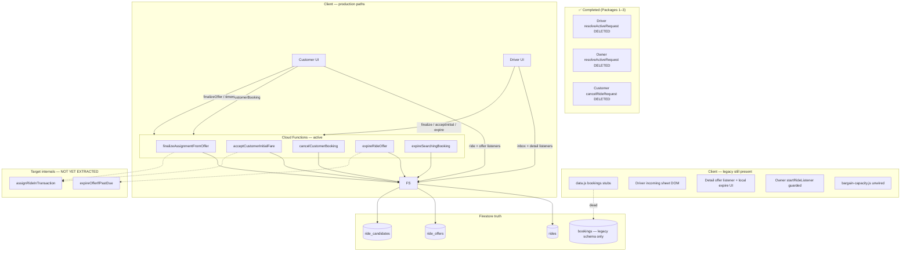
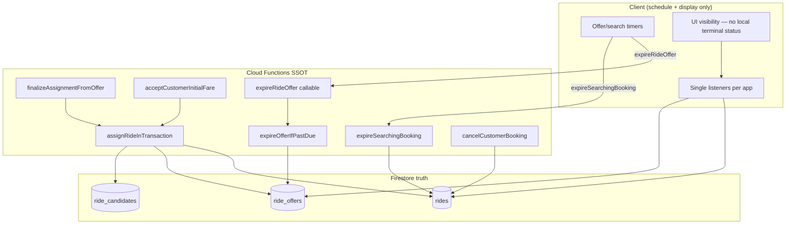

# Ride Assignment Cleanup — Project Status Report (Post Package 3)

**Date:** 2026-08-07  
**Packages complete:** 1 (driver) · 2 (owner) · 3 (customer cancel) — **all frozen**  
**Recovery tags:**  
- `ssot/package1-complete-20260806`  
- `ssot/package2-complete-20260807`  
- `ssot/package3-complete-20260807`  

**Scope:** Status review and planning only — **no source code modified in this report**

---

## Executive summary

Packages 1–3 eliminated **all P0 client bypass paths** for ride assignment and customer cancel. Production assign and cancel now have **zero latent client writers** in driver, owner, or customer apps. Broader SSOT cleanup — duplicate listeners, timers, server writer consolidation, legacy booking stubs, and owner legacy dispatch — **remains in progress**.

**Headline metrics (updated):**

| Metric | Before P3 | After P3 |
|--------|-----------|----------|
| Client assign bypass | 100% removed | **100%** (unchanged) |
| P0 audit remove targets | 50% | **100%** |
| All planned removal targets (§10) | ~17% (2/12) | **~25% (3/12)** |
| SSOT Phase M1 (latent bypass) | 50% | **60%** (M1.1–M1.3 done) |
| Full SSOT roadmap M0–M8 | ~15% | **~22%** |

---

## 1. Total cleanup completed so far

### 1.1 Frozen packages (do not modify unless bug)

| Package | Tag | File | Removed | Lines | Deploy | Physical |
|---------|-----|------|---------|-------|--------|----------|
| **1** | `ssot/package1-complete-20260806` | `driver-app/js/driver-app.js` | `resolveActiveRequest` | 92 | Hosting only | PASS |
| **2** | `ssot/package2-complete-20260807` | `owner-app/js/owner-app.js` | `resolveActiveRequest` | 94 | Hosting only | PASS |
| **3** | `ssot/package3-complete-20260807` | `customer-app/js/data.js` | `cancelRideRequest` | 10 | Hosting only | PASS |

**Total lines removed (assignment SSOT):** **196 lines** across 3 functions in 3 files.

### 1.2 Audit IDs closed by Packages 1–3

| IDs closed | Description |
|------------|-------------|
| AP-03, FW-03 | Driver client assign bypass |
| AP-04, FW-04, CO-05 (partial) | Owner client assign bypass |
| LG-07, FW-08, CD-14, CO-02 (partial) | Customer client cancel bypass |

### 1.3 Authoritative production paths (unchanged, verified)

| Flow | Authority |
|------|-----------|
| **Assign** | `finalizeAssignmentFromOffer` · `acceptCustomerInitialFare` → `functions/bargaining.js` |
| **Cancel (customer)** | `cancelCustomerBookingClient` → CF `cancelCustomerBooking` |
| **Offer expiry trigger** | Client timers → CF `expireRideOffer` |
| **Search expiry trigger** | Client 180s timer → CF `expireSearchingBooking` |

### 1.4 Grep verification (2026-08-07)

- `resolveActiveRequest` — **0 matches** in repo  
- `cancelRideRequest` — **0 matches** in repo  

---

## 2. Remaining legacy code

### 2.1 Customer — `customer-app/js/data.js` (P2)

| ID | Function / asset | Status | Callers | Risk if invoked |
|----|------------------|--------|---------|-----------------|
| LG-01 | `watchBookings` | **Dead** | 0 | Legacy `bookings/` listener |
| LG-02 | `createBooking` | **Dead** | 0 | Writes legacy `bookings/` |
| LG-03 | `acceptDriverOffer` | **Stub** | 0 | Throws redirect |
| LG-04 | `rejectDriverOffer` | **Stub** | 0 | Throws |
| LG-05 | `counterDriverOffer` | **Stub** | 0 | Throws |
| LG-06 | `createRideRequest` | **Stub** | 0 | Throws |

**Active in same file:** `watchRideRequest` (canonical ride listener) — **keep**.

### 2.2 Driver — legacy incoming sheet (P2)

| ID | File | Asset | Status |
|----|------|-------|--------|
| LG-08 | `driver-app/js/driver-app.js` | `startRideListener` | **Disabled** no-op stub |
| LG-09 | same | `showIncomingRide` | **Disabled** no-op stub |
| LG-10 | `driver-app/index.html` | `#incomingRideSheet`, `#acceptRideBtn` | **Dead DOM** (disabled) |

### 2.3 Driver — unused module (P2)

| ID | File | Status |
|----|------|--------|
| PL-09 | `driver-app/js/bargain-capacity.js` | **Unwired** — not imported anywhere |

### 2.4 Driver — archive read path (conditional P2)

| ID | File | Asset | Status |
|----|------|-------|--------|
| LG-13 | `RideRequestDetail.js` | `ride_requests` in `collectionNameFor` | **Active read-only** — remove when archive empty |

### 2.5 Owner — legacy dispatch fork (P1)

| ID | File | Functions | Status |
|----|------|-----------|--------|
| LG-11, LG-12, PL-10 | `owner-app/js/owner-app.js` | `startRideListener`, `showIncomingRide` | **Guarded** by `OWNER_FLEET_ONLY=true` early return; code still present |
| FW-06, PL-11 | same | `advanceActiveRideStatus`, `startActiveRideWatch` | **Duplicate** of driver post-assign paths |

### 2.6 Rules / schema legacy (P3)

| ID | File | Item | Blocked by |
|----|------|------|------------|
| LG-15 | `firestore.rules` | `bookings/{id}` rules block | LG-01/LG-02 still in `data.js` |

### 2.7 Coexistence (operational, not assignment logic)

| ID | Issue | Status |
|----|-------|--------|
| CO-08 | Dual deploy trees (lab vs prod) | Operational |
| CO-09 | `hosting-dist/` vs source apps | Build pipeline — enforce health check |
| CO-10 | Shared modules copied per app | Sync via `build-hosting.mjs` |

---

## 3. Remaining duplicate listeners

| ID | Location | Duplicate of | Status | Recommendation |
|----|----------|--------------|--------|----------------|
| **PL-02** | `RideRequestDetail.js` → `onSnapshot(ride_offers/{rideId}_{uid})` | PL-01 inbox | **Active duplicate** | **Merge** — inbox `getOfferForRide` only |
| **PL-05** | `AvailableRidesList.js` → `subscribePendingRadarRides` | PL-04 `driver-app.js` | **Active duplicate** | **Merge** — single subscription + cache |
| **PL-09** | `bargain-capacity.js` → `subscribeOpenBargainCount` | PL-01 | **Dead** | **Remove** with file |
| **PL-10** | `owner-app.js` → `startRideListener` global query | PL-04 pattern | **Guarded legacy** | **Remove** |
| **PL-11** | `owner-app.js` → `startActiveRideWatch` | PL-12 driver | **Uncertain** | Merge if owner drives; else remove |

**Kept (not duplicates):** Customer PL-06 + PL-07; driver PL-01, PL-03, PL-04, PL-12, PL-13; history/earnings listeners.

**Target after cleanup:** Driver max 3 assignment listeners (candidates, offers inbox, active ride). Customer max 2 while searching (ride doc, offers query).

---

## 4. Remaining duplicate timers

| ID | Location | Duplicate of | Status | Recommendation |
|----|----------|--------------|--------|----------------|
| TM-04/TM-05 | `driver-offer-inbox.js` schedule + 1s tick | TM-01/TM-02 customer | **Active** | Keep until M7 shared module |
| **TM-06** | `RideRequestDetail.js` → `detailExpiryTick` 1s | TM-05 inbox tick | **Active duplicate** | **Remove** with M2 |
| TM-07 | Inbox `visibilitychange` | TM-03 customer | **Active** | OK — one per app until M7 |

**Kept:** Customer TM-01–TM-03 (offer expiry); TM-08–TM-11 (search/rematch/display).

**Duplicate cluster (driver):** Inbox L1 timers + detail 1s tick + `applyOfferExpiryUi` calls = **three parallel expiry loops** on detail screen.

---

## 5. Remaining duplicate Firestore writes

### Removed (Packages 1–3)

| ID | Write | Status |
|----|-------|--------|
| FW-03 | Client driver assign | **Removed** |
| FW-04 | Client owner assign | **Removed** |
| FW-08 | Client `cancelRideRequest` → `cancelled_by_user` | **Removed** |

### Remaining

| ID | Location | Write | Severity | Notes |
|----|----------|-------|----------|-------|
| **FW-01/FW-02** | `bargaining.js` | Two assign writers | **Intentional** | Merge in M4 → `assignRideInTransaction` |
| **FW-06** | `owner-app.js` `advanceActiveRideStatus` | arrived/in_progress | Low | Owner fleet-only fork |
| **FW-09–11** | Search expire paths | ride `expired` | **Intentional parallel** | Client timer + reconcile + admin |
| **FW-12–16** | Offer expire paths | offer `expired` | **Intentional parallel** | Need `expireOfferIfPastDue` wrapper (M5) |
| **FW-18** | `RideRequestDetail.js` `applyOfferExpiryUi` | **Local** `status=expired` (not Firestore) | **P1** | UI drift risk — remove with M2 |
| LG-02 (latent) | `data.js` `createBooking` | `bookings/` doc create | **P2 dead** | Never called today |

**Client assign/cancel bypass writes:** **Zero remaining.**

---

## 6. Remaining duplicate Cloud Functions

No accidental duplicate **exports** for assignment. Intentional parallel paths:

| ID | Export / internal | Overlaps | Status | Target |
|----|-------------------|----------|--------|--------|
| CF-01 | `finalizeAssignmentFromOffer` | CF-02 | **Active** | Thin wrapper → `assignRideInTransaction` (M4) |
| CF-02 | `acceptCustomerInitialFare` | CF-01 | **Active** | Same |
| CF-03 | `expireRideOffer` | CF-04, CF-05 | **Active** | Route through `expireOfferIfPastDue` (M5) |
| CF-04 | `expireDueRideOffers` | CF-03 | Admin batch | Keep; consolidate logic |
| CF-05 | `expireDueOffersForRide` (piggyback) | CF-03 | Event-driven | Keep; consolidate logic |
| CF-06 | `expireSearchingBooking` | CF-07, CF-08 | **Active** | Keep separate from offer expiry |
| CF-07 | `expireDueSearchingBookings` | CF-06 | Admin | Keep |
| CF-08 | `reconcileCustomerBookingState` | CF-05/06 | Gate/reconcile | Keep |

**No new CF should be added for SSOT cleanup** — consolidate internals in M4/M5.

---

## 7. Remaining business-rule duplication

### 7.1 Fully single-path today

| Rule | Authority | Enforcement |
|------|-----------|-------------|
| Assign from `searching_driver` | CF only | Rules deny client; bypass **deleted** |
| Customer cancel while searching | `cancelCustomerBooking` CF | Bypass **deleted** |
| Offer doc create/update | CF only | Rules: client write false |
| Offer terminal / no reopen | `submitRideOffer` guards | CF |
| Booking slot limit (4) | `createCustomerBooking` tx | CF |
| Driver open bargain cap (10) | `submitRideOffer` | CF |
| Ride completion + settlement | `completeRideSettlement` | CF |

### 7.2 Duplicate rule implementations (server — not yet consolidated)

| Rule | Implementations | Risk |
|------|-----------------|------|
| Assign transaction fields | `finalizeAssignmentFromOffer` vs `acceptCustomerInitialFareAsDriver` | Must stay synchronized until M4 |
| Offer timeout → expired | `expireRideOffer`, piggyback, admin batch, inline guards | Logic strings duplicated until M5 |
| Search timeout → expired | Client timer, reconcile, admin batch | Parallel by design; document only |

### 7.3 Client-side rule drift (remaining)

| Rule | Issue | IDs |
|------|-------|-----|
| Offer visible after timeout | Local filter + `applyOfferExpiryUi` can drift from server | CD-01, CD-02, CD-04, FW-18 |
| Accept-initial vs custom offer mutual exclusion | Partially client-gated in detail | CD-03 |
| Owner global ride visibility | Legacy listener if fleet guard removed | LG-11, PL-10 |

---

## 8. Remaining client-side decisions

| ID | File | Decision | Status | Target |
|----|------|----------|--------|--------|
| CD-01 | `offer-client.js` | Hide offer before server expire | **Active** | Keep; always call CF-03 |
| CD-02 | `driver-offer-inbox.js` | Filter expired from inbox map | **Active** | Keep |
| CD-03 | `RideRequestDetail.js` | Show/hide accept-initial panel | **Active** | Keep; mirror server errors |
| **CD-04** | `RideRequestDetail.js` | `applyOfferExpiryUi` local `expired` | **Duplicate** | **Remove** (M2) |
| CD-05 | `RideRequestDetail.js` | Optimistic bid UI | **Active** | Keep; reconcile on snapshot |
| CD-06–09 | `ride-flow.js` | Offer visibility, search timers, ghost purge | **Active** | Keep (CF-backed) |
| CD-10 | `ride-status.js` | Legacy status normalize | **Active** | Keep compat shim |
| CD-11 | `driver-app.js` | arrived/in_progress | **Active** | Keep (rules-gated) |
| ~~CD-14~~ | ~~`data.js` `cancelRideRequest`~~ | ~~Cancel without CF~~ | **Removed** (P3) | — |

**SSOT principle violation still open:** Local mutation of offer status to `expired` (CD-04 / FW-18).

---

## 9. Remaining server-side duplication

| ID | Area | Duplication | Target (M4/M5) |
|----|------|-------------|----------------|
| SD-01–03 | Assign guards + expiry checks | Duplicated in two assign callables | `assignRideInTransaction` |
| SD-01 | Offer expiry clock | Branched in 4+ CF paths | `expireOfferIfPastDue` |
| AP-01/AP-02 | Two assign engines | Parallel by design today | Single internal writer |
| Inline guards | counter/reject/finalize/acceptInitial | Duplicate `isOfferPastTimeout` | Route through wrapper |

**Authoritative helpers that already exist:** `markOfferTimedOutInTx`, `isOfferPastTimeout`, `resolveOfferExpiryMs` — need **routing**, not rewrite.

---

## 10. Updated cleanup percentage

| Scope definition | Done | Total | **Complete** |
|------------------|------|-------|--------------|
| **Client assign bypass** (AP-03, AP-04) | 2 | 2 | **100%** |
| **Client cancel bypass** (LG-07) | 1 | 1 | **100%** |
| **All P0 remove rows** (audit §10) | 2 | 2 | **100%** |
| **All “Remove” targets** (audit §10, P0–P3) | 3 packages | ~12 discrete targets | **~25%** |
| **SSOT Phase M1** (M1.1–M1.5) | M1.1, M1.2, M1.3 | 5 steps | **60%** |
| **SSOT Phases M2–M8** | — | 6 phases + M8 sign-off | **0%** |
| **Full SSOT roadmap weighted** | M1 partial + 3 packages | M0–M8 | **~22%** |
| **Success criterion:** zero client assign/cancel outside CF | ✓ | — | **Met** |
| **Success criterion:** zero local offer `expired` mutation | ✗ | — | **Not met** (M2) |
| **Success criterion:** one driver offer listener | ✗ | — | **Not met** (M2) |

**Recommended headline for stakeholders:**  
**~25% of planned removal work complete · 100% of P0 bypass risk eliminated · ~22% of full SSOT roadmap.**

---

## 11. Updated architecture diagram

### 11.1 Current state (after Package 3)

### 11.2 Target end state (SSOT v1 — unchanged goal)

---

## 12. Recommended execution order (safest → highest risk)

Each row is one **approval-gated package**. Do not combine unless explicitly approved.

| Order | Package | SSOT phase | Scope summary |
|-------|---------|------------|---------------|
| **4** | Delete `bargain-capacity.js` | M1.4 | Entire unwired file |
| **5** | Delete customer `data.js` legacy stubs | M6.1 (partial) | `watchBookings`, `createBooking`, offer stubs LG-01–06 |
| **6** | Delete driver incoming sheet legacy | M6 (partial) | LG-08–10: stubs + DOM + refs |
| **7** | Merge driver detail → inbox offer state | M2 | PL-02, TM-06, FW-18, CD-04 |
| **8** | Single radar subscription | M3 | PL-05 |
| **9** | Remove owner legacy listeners | M6 (partial) | LG-11–12, PL-10, CO-06 |
| **10** | Remove `bookings/` Firestore rules | M6.2 | LG-15 (after Package 5) |
| **11** | Remove owner duplicate progression | P3 | FW-06, PL-11 (product decision) |
| **12** | Remove `ride_requests` archive path | Conditional | LG-13 — after Firestore archive query |
| **13** | Server assign SSOT | M4 | AP-01/AP-02 → `assignRideInTransaction` |
| **14** | Server offer expiry SSOT | M5 | CF-03/04/05 → `expireOfferIfPastDue` |
| **15** | Shared offer expiry scheduler (optional) | M7 | TM-04/05/07 + customer TM-01–03 |
| **16** | Physical sign-off + tag | M8 | `ssot/ride-assignment-v1` |

---

## 13. Risk level per remaining package

| Package | Risk | Rationale |
|---------|------|-----------|
| **4** — `bargain-capacity.js` | **Low** | File never imported; zero runtime surface |
| **5** — customer `data.js` stubs | **Low** | 0 production callers; grep verified; test asserts `createBooking` throws only |
| **6** — driver incoming sheet | **Low** | Already disabled no-ops; DOM inert |
| **7** — detail offer listener merge | **High** | Active UI; P1-B drift history; accept-initial panel regression risk |
| **8** — single radar subscription | **Medium** | List/detail sync; empty radar if cache wrong |
| **9** — owner legacy listeners | **Medium** | Needs `OWNER_FLEET_ONLY` proof; global query leak if guard fails |
| **10** — `bookings/` rules | **Low** | Only after client stubs gone; rules-only deploy |
| **11** — owner `advanceActiveRideStatus` | **Medium** | Product dependency: owner-as-driver |
| **12** — `ride_requests` archive | **Low** | Read-only; only if archive empty |
| **13** — M4 assign consolidation | **High** | Functions deploy; all assign paths; lab + physical required |
| **14** — M5 expiry consolidation | **High** | Functions deploy; P1-B expire regression surface |
| **15** — M7 shared scheduler | **Medium** | Cross-app timer behavior |
| **16** — M8 sign-off | **Low** | Validation only |

---

## 14. Estimated benefit per remaining package

| Package | Primary benefit | Secondary benefit |
|---------|-----------------|-------------------|
| **4** | Removes dead `ride_offers` query code | Completes M1; reduces confusion |
| **5** | Eliminates legacy `bookings/` write surface | Unblocks rules cleanup (Pkg 10) |
| **6** | Removes dead DOM and stub functions | Smaller driver bundle; no dual dispatch UI |
| **7** | **Fixes offer UI drift** (accept-initial reappear, stale expired) | One driver offer listener; removes TM-06/FW-18 |
| **8** | Halves candidate Firestore listener cost | Single radar cache; consistent list/detail |
| **9** | Removes global searching leak vector | Owner app aligned with fleet-only product |
| **10** | Closes legacy schema in security rules | Smaller rules surface |
| **11** | Removes duplicate post-assign client writer | Owner/driver parity |
| **12** | Simplifies detail fetch path | One collection for rides |
| **13** | **Single assign transaction** — no sync drift between AP-01/AP-02 | Easier future rule changes |
| **14** | **Single expiry decision** — consistent timeout everywhere | Fewer P1-B class bugs |
| **15** | One timer implementation customer+driver | Easier testing; less duplicate code |
| **16** | Declares SSOT v1 complete | Release tag; audit closure |

---

## Appendix A — Business rules protection matrix

| Rule | Single path today? | Gap |
|------|-------------------|-----|
| Assign | **Yes** (CF only) | Internal duplicate writers (M4) |
| Cancel customer | **Yes** (CF only) | — |
| Offer expiry write | **Yes** (CF `markOfferTimedOutInTx`) | Multiple CF entry points (M5) |
| Offer expiry UX | **No** | Client local expire (M2) |
| Search expiry | **Yes** (CF triggered) | Parallel triggers OK |
| Candidate invite | **Yes** | — |
| Settlement | **Yes** | — |

---

## Appendix B — Frozen packages (do not modify)

| Package | Tag | Commit area |
|---------|-----|-------------|
| 1 | `ssot/package1-complete-20260806` | Driver assign bypass removed |
| 2 | `ssot/package2-complete-20260807` | Owner assign bypass removed |
| 3 | `ssot/package3-complete-20260807` | Customer cancel bypass removed |

---

## Appendix C — References

- `docs/specs/RIDE-ASSIGNMENT-SINGLE-SOURCE-OF-TRUTH.md` — target architecture M0–M8  
- `docs/specs/RIDE-ASSIGNMENT-DUPLICATE-FLOW-AUDIT.md` — full duplicate inventory  
- `docs/specs/RIDE-ASSIGNMENT-ARCHITECTURE-AUDIT.md` — file-level audit  
- `docs/specs/PACKAGE3-COMPLETION-REPORT.md` — Package 3 evidence  

---

**End of status report. No source code modified. Package 4 not started.**
