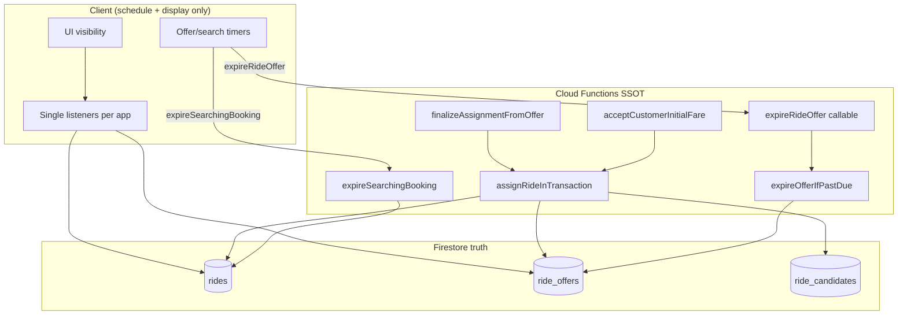

# Ride Assignment — Single Source of Truth (Target Architecture)

**Date:** 2026-08-06  
**Status:** Cleanup in progress — **Package 1 CLOSED / FROZEN**  
**Recovery tag:** `ssot/package1-complete-20260806`  
**Inputs:**  
- `docs/specs/RIDE-ASSIGNMENT-ARCHITECTURE-AUDIT.md`  
- `docs/specs/RIDE-ASSIGNMENT-DUPLICATE-FLOW-AUDIT.md`  
- P1-B physical failures and bypass fixes (2026-08-06)  
- `docs/specs/PACKAGE1-COMPLETION-COMPARISON-REPORT.md` (Package 1 closed)

**Goal:** One authoritative write path for assignment, one authoritative write path for offer expiry, one listener per concern per app, and clients that **schedule** and **display** but never **decide** business outcomes.

---

## Package 1 — COMPLETE (frozen)

| Item | Record |
|------|--------|
| **Removed** | `driver-app/js/driver-app.js` → `resolveActiveRequest` (92 lines) |
| **Deploy** | Hosting only · `?v=package1_ssot_step2_delete_1` |
| **Physical** | PASS (2026-08-06) |
| **Behavior change** | **Zero** — dead code only |
| **Do not modify** | Package 1 unless bug discovered |

**Remaining client legacy assign (next):** ~~`owner-app/js/owner-app.js` → `resolveActiveRequest`~~ **REMOVED (Package 2 ✓)** · `createBooking`, `cancelRideRequest` (customer) — future packages.

**Completed migration steps:** M1.1 (driver `resolveActiveRequest`) · M1.2 (owner `resolveActiveRequest`) — **DONE / frozen**.

---

## Package 2 — COMPLETE (frozen)

| Item | Record |
|------|--------|
| **Removed** | `owner-app/js/owner-app.js` → `resolveActiveRequest` (94 lines) |
| **Deploy** | Hosting only |
| **Physical** | PASS — owner fleet flow |
| **Behavior change** | **Zero** |
| **Recovery tag** | `ssot/package2-complete-20260807` |
| **Do not modify** | Package 2 unless bug discovered |

---

## 0. Design principles

1. **Server writes truth.** Clients may hide UI early only after calling the authoritative CF; they must never mutate local offer/ride status as if it were Firestore.
2. **One writer per terminal transition.** Exactly one implementation sets `rides.status = accepted` from bargaining; exactly one helper sets `ride_offers.status = expired` for timeout.
3. **One listener per concern.** Each app holds one subscription for offers, one for candidates (driver), one for active ride doc (customer/driver).
4. **Two UX entry points, one engine.** “Accept customer initial fare” and “Finalize from offer” remain different **intents**, but share one **assignment transaction**.
5. **Piggyback is reinforcement, not authority.** Reconcile/rematch/admin batch expire paths call the same internal expiry helper; they do not duplicate rules.
6. **No Cloud Scheduler** unless explicitly approved later; client-assisted expiry remains the primary clock for offer TTL during normal app use.

---

## 1. Single authority for ride assignment

### 1.1 Decision

| Layer | Single authority | Location (target) |
|-------|------------------|-------------------|
| **Internal write** | `assignRideInTransaction(tx, ctx)` | `functions/bargaining.js` (new internal; not exported) |
| **Public callable(s)** | Thin validators only — no direct `rides.status = accepted` elsewhere | `finalizeAssignmentFromOffer`, `acceptCustomerInitialFare` call `assignRideInTransaction` |

**`assignRideInTransaction` is the only function allowed to:**

- Set `rides/{rideId}.status = accepted`
- Set `ride_offers/{offerId}.status = accepted` (or create+accept for direct-initial path)
- Update `ride_candidates/{rideId}_{driverId}.status = accepted`
- Set `partners.activeRideId`, `vehicles.status = in_ride`, `assignmentSessionToken`, fare fields

**Today:** `finalizeAssignmentFromOffer` and `acceptCustomerInitialFareAsDriver` each contain overlapping assignment transaction logic (duplicate writers — AP-01/AP-02).

**Target:** Both callables validate actor, offer/ride preconditions, and expiry — then delegate to **`assignRideInTransaction`**.

### 1.2 Callable surface (unchanged for clients)

| Callable | Intent | Delegates to |
|----------|--------|--------------|
| `finalizeAssignmentFromOffer` | Customer accepts driver offer, or driver accepts counter | `assignRideInTransaction` with `source: 'offer_finalize'` |
| `acceptCustomerInitialFare` | Driver accepts customer estimated fare **without** prior custom-offer negotiation | `assignRideInTransaction` with `source: 'direct_initial_fare'` |

**Rule:** No other Cloud Function, client transaction, or Firestore rule path may assign a ride from `searching_driver`.

### 1.3 Explicitly forbidden as assignment authorities

| Function | Action | Target disposition |
|----------|--------|-------------------|
| `resolveActiveRequest` | Client tx → `accepted` | **Deleted** driver-app (Package 1 ✓) · **Deleted** owner-app (Package 2 ✓) |
| `createBooking` / `bookings/` | Legacy booking | **Delete** |
| Any direct client `updateDoc` on `rides.status` except arrived/in_progress | Bypass | **Block** except rules-approved progression |

### 1.4 Post-assignment status (out of scope for “assignment”)

`accepted → arrived → in_progress` remains **client `updateDoc`** (rules-gated).  
`in_progress → completed` remains **`completeRideSettlement`** only.

---

## 2. Single authority for offer expiry

### 2.1 Decision

| Layer | Single authority | Location (target) |
|-------|------------------|-------------------|
| **Internal write** | `markOfferTimedOutInTx(tx, offerRef)` | Already exists in `functions/bargaining.js` |
| **Internal decision** | `expireOfferIfPastDue(db, { offerId, actorUid, nowMs })` | **New wrapper** — sole place that reads clock + decides expire vs skip |
| **Public callable (client clock)** | `expireRideOffer` | Calls `expireOfferIfPastDue` only |
| **Piggyback / admin / inline guards** | All call `expireOfferIfPastDue` or `markOfferTimedOutInTx` via that wrapper | No duplicated `isOfferPastTimeout` branches |

**`expireOfferIfPastDue` is the only function allowed to:**

- Transition `ride_offers` from `open`/`countered` → `expired` with `closedReason: offer_timeout`
- Return `{ status: 'expired' | 'not_yet_expired' | 'already_closed' }`

**Today:** Expiry logic is duplicated across `expireRideOffer`, `expireDueOffersForRide`, `expireDueRideOffers`, and inline guards in counter/reject/finalize/acceptInitial (CF-03–CF-05, CF-16).

**Target:** All paths invoke **`expireOfferIfPastDue`** (or run it inside the same transaction before reject/assign).

### 2.2 What is NOT offer-expiry authority

| Function | Role | Keep? |
|----------|------|-------|
| Client `isOfferPastExpiryLocal` | **Schedule + UI filter only** | Yes — must call `expireRideOffer` CF, never write status |
| `closeCandidatesAndOffersForRide` | Ride-level close (search cancel/expire) | Yes — different reason (`search_timeout`, not `offer_timeout`) |
| `withdrawRideOffer` | Driver withdraw | Yes — `withdrawn`, not `expired` |

### 2.3 Search expiry (separate SSOT)

Ride search timeout remains **`expireSearchingBooking`** (internal) + callable — **not** merged with offer expiry.  
Internal helper: `expireSearchingRideIfPastDue` (optional rename of existing logic).

---

## 3. Single Firestore listener per concern

### 3.1 Customer app

| Concern | **Keep** (only listener) | Remove / merge from |
|---------|--------------------------|---------------------|
| Active ride doc | `watchRideRequest` → `onSnapshot(rides/{rideId})` in `data.js` | — |
| Open offers for ride | `watchRideOffers` → query in `offer-client.js` | — |
| Legacy bookings | — | `watchBookings` (**delete**) |

**Binding:** `ride-flow.js` lifecycle attaches exactly **one** ride listener + **one** offer listener per bound ride generation.

### 3.2 Driver app

| Concern | **Keep** (only listener) | Remove / merge from |
|---------|--------------------------|---------------------|
| Invited candidates | **One** `subscribePendingRadarRides` owned by `driver-app.js` | Second copy in `AvailableRidesList.js` (**merge**) |
| Driver open offers | **One** `createDriverOfferInbox` query in `driver-offer-inbox.js` | Per-doc listener in `RideRequestDetail.js` (**remove**) |
| Active execution ride | **One** `startActiveRideWatch` in `driver-app.js` | — |
| Detail ride status | **One** `onSnapshot(rides/{id})` in detail while detail open | OK — ride doc only, not offers |
| Dispatch settings | `settings/dispatch` watch in `driver-app.js` | — |
| Bargain capacity | — | `bargain-capacity.js` (**delete**) |

**Detail screen rule:** `RideRequestDetail` reads offer state via **`getOfferForRide(rideId)`** from inbox — **no** `ride_offers` listener in detail.

### 3.3 Owner app

| Concern | Target |
|---------|--------|
| Dispatch / assign | **No listeners** until owner-app is aligned with driver radar — remove `startRideListener` global searching query |
| Active ride | Reuse shared `active-ride-watch.mjs` (future) or driver parity — not two forks |

### 3.4 Post-assignment (parallel, not assignment SSOT)

P2P `ride_peer_sessions`, viewer presence, earnings history listeners remain **outside** assignment SSOT.

---

## 4. Timers that remain

### 4.1 Customer — keep

| Timer | File | Purpose |
|-------|------|---------|
| Per-offer `setTimeout` until `offerExpiresAt` | `offer-client.js` | Wake L2 → call `expireRideOffer` |
| `setInterval` 1s offer flush | `offer-client.js` | Mobile throttle recovery |
| `visibilitychange` offer flush | `offer-client.js` | Tab resume |
| `SEARCH_TIMEOUT_MS` 180s | `ride-flow.js` | → `expireSearchingBooking` |
| `SEARCH_REMATCH_MS` 30s | `ride-flow.js` | → `matchRideCandidates` |
| Search UI countdown 1s | `ride-flow.js` | Display only |

### 4.2 Driver — keep

| Timer | File | Purpose |
|-------|------|---------|
| Per-offer `setTimeout` | `driver-offer-inbox.js` | Wake L1 → call `expireRideOffer` |
| `setInterval` 1s inbox flush | `driver-offer-inbox.js` | Throttle recovery |
| `visibilitychange` inbox flush | `driver-offer-inbox.js` | Tab resume |

### 4.3 Driver — remove

| Timer | File | Reason |
|-------|------|--------|
| `detailExpiryTick` 1s | `RideRequestDetail.js` | Duplicate of inbox L1 |

### 4.4 Future consolidation (post-cleanup)

Single shared module `shared/js/offer-expiry-scheduler.mjs` imported by customer + driver — **one implementation** of schedule/tick/visibility calling the same CF. Not required for first cleanup wave.

---

## 5. Duplicate listeners to remove

| ID | Listener | File | Replacement |
|----|----------|------|-------------|
| PL-02 | `onSnapshot(ride_offers/{rideId}_{uid})` | `RideRequestDetail.js` | Inbox `getOfferForRide` + `syncFromInbox` on inbox events only |
| PL-05 | Second `subscribePendingRadarRides` | `AvailableRidesList.js` | Subscribe to radar cache exported from `driver-app.js` |
| PL-09 | `subscribeOpenBargainCount` | `bargain-capacity.js` | Delete file |
| PL-10 | Global `rides` searching query | `owner-app.js` | Delete |
| LG-01 | `watchBookings` | `data.js` | Delete |

**After cleanup:** Driver has **3** assignment-related listeners max while online: candidates (1), offers inbox (1), active ride (0–1). Customer has **2** while searching: ride (1), offers (1).

---

## 6. Legacy functions to delete

### 6.1 Client — delete list

| File | Functions / assets |
|------|-------------------|
| `customer-app/js/data.js` | `watchBookings`, `createBooking`, `acceptDriverOffer`, `rejectDriverOffer`, `counterDriverOffer`, `createRideRequest`, `cancelRideRequest` |
| `driver-app/js/driver-app.js` | `resolveActiveRequest`, `startRideListener`, `showIncomingRide`, refs to incoming sheet |
| `driver-app/index.html` | `#incomingRideSheet`, `#acceptRideBtn` (legacy) |
| `driver-app/js/bargain-capacity.js` | Entire file |
| `owner-app/js/owner-app.js` | `resolveActiveRequest`, `startRideListener`, `showIncomingRide` |

### 6.2 Client — delete after archive empty

| File | Item |
|------|------|
| `RideRequestDetail.js` | `ride_requests` branch in `collectionNameFor` |

### 6.3 Rules / schema — delete when clients gone

| File | Item |
|------|------|
| `firestore.rules` | `bookings/{id}` match block |

### 6.4 Server — do not delete (consolidate instead)

| Item | Action |
|------|--------|
| `finalizeAssignmentFromOffer` | Keep callable; thin wrapper |
| `acceptCustomerInitialFare` | Keep callable; thin wrapper |
| `expireRideOffer` | Keep callable |
| `expireDueRideOffers` / piggyback | Keep; route through `expireOfferIfPastDue` |

---

## 7. Client decisions that must move to server

| Today (client decides) | Problem | Target |
|----------------------|---------|--------|
| `applyOfferExpiryUi` sets `myOfferState.status = 'expired'` | UI pretends terminal state without server | **Remove** — UI reads Firestore/inbox only |
| `isOfferPastExpiryLocal` hides offer without guaranteed CF call | Server stays `open` | Keep filter **only after** `expireRideOffer` invoked (or await snapshot `expired`) |
| `syncOfferUi` / `driverOfferRecordExists` gates accept-initial | Partially client-side mutual exclusion | **Server already authoritative** — client gate is UX only; must mirror server errors (`OFFER_NEGOTIATION_ACTIVE`, `OFFER_EXPIRED`) |
| `cancelRideRequest` direct Firestore cancel | Bypasses CF cancel/slots | **Delete** — use `cancelCustomerBookingClient` only |
| `resolveActiveRequest` assign | Full bypass | **Delete** |
| Optimistic `myOfferState` after `submitBid` | OK for UX if snapshot reconciles | **Keep** display-only; never use for accept/expire decisions without snapshot |
| `purgeGhostSearchingRides` heuristic cancel | Client guess | **Keep** but only via `cancelCustomerBookingClient` (already does); document heuristic |

**Client may retain:**

- When to **call** CF (timers, button clicks)
- **Visibility** (hide buttons, panels)
- **Display** normalization (`normalizeCustomerRideStatus`)
- **arrived / in_progress** button (rules already server-gated)

---

## 8. Server decisions that remain authoritative

| Decision | Authority | Must not be reimplemented on client |
|----------|-----------|-------------------------------------|
| Offer past `offerExpiresAt` | `expireOfferIfPastDue` / `isOfferPastTimeout` | Client clock is hint only |
| Assign allowed / rejected | `assignRideInTransaction` | — |
| Direct initial fare allowed | Same — checks no blocking offer doc | — |
| Open offer / counter / terminal | `submitRideOffer`, guards | — |
| Candidate invited / declined | `matchRideCandidates`, `declineRideCandidate` | — |
| Search past 3 min | `expireSearchingBooking` | Client timer triggers CF only |
| Booking slot count (4 max) | `createCustomerBooking` tx | — |
| Driver open bargain cap (10) | `submitRideOffer` | — |
| Vehicle linked / driver blocked | All assign paths | — |
| Settlement / partial cancel fare | `cancelCustomerBooking`, `completeRideSettlement` | — |
| Offer doc create/update/delete | **Cloud Functions only** (rules deny client) | — |
| Sibling offer cleanup | `closeSiblingOffers` post-assign | — |
| Rematch exclude driver | `cancelAssignedRideByDriver` | — |

**Inline guards** on counter/reject/assign remain authoritative **fallbacks** when client timer fails — they must call the same `expireOfferIfPastDue` helper, not duplicate logic strings.

---

## 9. Exact migration order

Each step is **deployable independently**. Lab + physical checklist after every step. **No P2-C.** No unrelated packages.

### Phase M0 — Baseline lock (no behavior change)

| Step | Work | Verification |
|------|------|--------------|
| M0.1 | Tag git `baseline/pre-ssot-cleanup` | Tag exists |
| M0.2 | Confirm lab `p1b-auto-expire-suite` 10/10 on validate tree | CI log |
| M0.3 | Export current CF + hosting SHAs to `docs/specs/SSOT-MIGRATION-BASELINE.md` | Manual record |

**Rollback M0:** N/A (no changes).

---

### Phase M1 — Remove latent bypass (client only, lowest risk)

| Step | Work | Files |
|------|------|-------|
| M1.1 | Delete `resolveActiveRequest` in driver-app | `driver-app.js` | **DONE** (Package 1, frozen) |
| M1.2 | Delete owner `resolveActiveRequest` | `owner-app.js` | **DONE** (Package 2, frozen) |
| M1.3 | Remove `cancelRideRequest`; grep callers → `cancelCustomerBookingClient` | `data.js`, callers |
| M1.4 | Delete `bargain-capacity.js` + any import | driver-app |
| M1.5 | Deploy hosting only | — |

**Rollback M1:** Redeploy hosting from `baseline/pre-ssot-cleanup` tag. Functions unchanged.

---

### Phase M2 — Unify driver offer listening (client)

| Step | Work | Files |
|------|------|-------|
| M2.1 | Remove offer `onSnapshot` from `RideRequestDetail` | `RideRequestDetail.js` |
| M2.2 | Detail uses `getOfferForRide` + `syncFromInbox` on inbox `onOffersChanged` only | `RideRequestDetail.js`, `ride-radar-controller.js` |
| M2.3 | Remove `detailExpiryTick` + `applyOfferExpiryUi` local status mutation | `RideRequestDetail.js` |
| M2.4 | Detail disable/hide from inbox snapshot + server errors only | same |
| M2.5 | Deploy hosting | — |

**Rollback M2:** Redeploy hosting from M1 tag. Inbox-only path reverted.

---

### Phase M3 — Single radar subscription (client)

| Step | Work | Files |
|------|------|-------|
| M3.1 | Own `subscribePendingRadarRides` only in `driver-app.js`; expose read-only cache | `driver-app.js` |
| M3.2 | `AvailableRidesList` consumes cache, no own unsub | `AvailableRidesList.js` |
| M3.3 | Deploy hosting | — |

**Rollback M3:** Redeploy hosting from M2 tag.

---

### Phase M4 — Server assignment SSOT (functions)

| Step | Work | Files |
|------|------|-------|
| M4.1 | Extract `assignRideInTransaction(tx, ctx)` from duplicate tx bodies | `bargaining.js` |
| M4.2 | Refactor `finalizeAssignmentFromOffer` → validate + delegate | same |
| M4.3 | Refactor `acceptCustomerInitialFareAsDriver` → validate + delegate | same |
| M4.4 | Lab: all Phase 2A + P1-B assign/expiry tests | `tests/` |
| M4.5 | Deploy **only** `finalizeAssignmentFromOffer`, `acceptCustomerInitialFare` | firebase |

**Rollback M4:** Redeploy functions from M3 hosting tag + previous functions revision (`firebase functions:log` revision id recorded in M0).

---

### Phase M5 — Server offer expiry SSOT (functions)

| Step | Work | Files |
|------|------|-------|
| M5.1 | Add `expireOfferIfPastDue`; route `expireRideOffer` through it | `bargaining.js` |
| M5.2 | Route piggyback `expireDueOffersForRide`, admin batch, inline guards | same |
| M5.3 | Lab `p1b-auto-expire-suite` + counter/reject/finalize guard cases | tests |
| M5.4 | Deploy expire-related functions only | firebase |

**Rollback M5:** Redeploy prior functions revision from M4 record.

---

### Phase M6 — Legacy data layer cleanup (client)

| Step | Work | Files |
|------|------|-------|
| M6.1 | Delete bookings stubs: `watchBookings`, `createBooking`, offer stubs | `data.js` |
| M6.2 | Remove `bookings/` rules block | `firestore.rules` |
| M6.3 | Deploy hosting + rules | — |

**Rollback M6:** Redeploy hosting + rules from M5 tag.

---

### Phase M7 — Shared offer expiry scheduler (optional polish)

| Step | Work | Files |
|------|------|-------|
| M7.1 | Extract `shared/js/offer-expiry-scheduler.mjs` | shared + both apps |
| M7.2 | Replace duplicate schedule/tick in offer-client + inbox | customer, driver |
| M7.3 | Deploy hosting | — |

**Rollback M7:** Redeploy hosting from M6 tag.

---

### Phase M8 — Physical sign-off & SSOT complete

| Step | Work |
|------|------|
| M8.1 | Physical: custom offer → timeout → no assign → no accept-initial reappear |
| M8.2 | Physical: CF logs `expireRideOffer_invoke` + `_result` |
| M8.3 | Physical: customer accept before timeout works |
| M8.4 | Physical: direct initial fare (no prior bid) works |
| M8.5 | Tag `ssot/ride-assignment-v1` |

**Rollback M8:** N/A — validation gate.

---

## 10. Rollback plan for every migration step

| Step | Rollback trigger | Rollback action | Data impact |
|------|------------------|-----------------|-------------|
| **M0** | — | — | None |
| **M1.1–M1.2** | Driver/owner regression | `git checkout baseline/pre-ssot-cleanup -- driver-app owner-app`; redeploy hosting | None |
| **M1.3** | Cancel flow breaks | Restore `data.js`; redeploy hosting | None |
| **M1.4** | Build failure | Restore `bargain-capacity.js` if needed; redeploy | None |
| **M1.5** | Any M1 physical fail | Full hosting rollback to M0 tag | None |
| **M2.1–M2.4** | Detail offer UI broken | Redeploy hosting at M1 tag | None |
| **M2.5** | Physical fail on driver detail | Same | None |
| **M3.1–M3.3** | Radar list empty/duplicate | Redeploy hosting at M2 tag | None |
| **M4.1–M4.5** | Lab fail / assign errors | `firebase deploy --only functions:finalizeAssignmentFromOffer,functions:acceptCustomerInitialFare` using **saved revision** from M0 | In-flight rides unaffected; new assigns use old code |
| **M5.1–M5.4** | Expiry regression | Redeploy expire function group from M4 revision snapshot | Offers may stay open until rollback deploy completes |
| **M5.5** | Physical expire fail | Functions rollback + hosting at M3 | Same |
| **M6.1–M6.3** | Unexpected caller of deleted APIs | Restore `data.js` + rules from M5 tag | None |
| **M7.1–M7.3** | Timer drift | Redeploy hosting M6 tag | None |
| **M8** | Sign-off fail | Do not tag; fix forward from last green tag | — |

### Rollback artifacts (required before M1)

1. Git tag `baseline/pre-ssot-cleanup` on known-good commit  
2. Record in `docs/specs/SSOT-MIGRATION-BASELINE.md`:  
   - Functions revision IDs (`expireRideOffer`, `acceptCustomerInitialFare`, `finalizeAssignmentFromOffer`)  
   - Hosting deploy timestamp + cache-bust query (`?v=...`)  
   - Lab pass output (`p1b-auto-expire-suite` 10/10)  
3. Firebase console: note active function revisions for one-click rollback reference  

### Rollback policy

- **Hosting rollback** is always safe and preferred for client-only phases (M1–M3, M6–M7).  
- **Functions rollback** required for M4–M5; never rollback functions without re-running lab suite on the target revision.  
- **Never** rollback by re-enabling `resolveActiveRequest` or `cancelRideRequest` — fix forward or revert entire phase tag.  
- **Firestore data** is not migrated; rollback is code-only. No data migration scripts in this plan.

---

## 11. Target architecture diagram

---

## 12. Success criteria (SSOT v1 complete)

- [ ] Exactly **one** internal function writes `rides.status = accepted` from bargaining (`assignRideInTransaction`)  
- [ ] Exactly **one** internal path writes offer timeout expiry (`expireOfferIfPastDue` → `markOfferTimedOutInTx`)  
- [ ] Driver: **one** offer listener (inbox), **one** candidate listener (driver-app), **zero** offer listeners in detail  
- [ ] Customer: **one** ride listener, **one** offer listener per ride  
- [ ] **Zero** client functions that assign or cancel rides outside CF  
- [ ] **Zero** local mutation of offer status to `expired`  
- [ ] Lab + physical P1-B checklist pass on tag `ssot/ride-assignment-v1`  

---

## 13. Explicit non-goals (this cleanup)

- Merging Customer/Driver/Owner into one app shell  
- Cloud Scheduler for offer/search expiry  
- Changing P2P, breadcrumbs, or settlement architecture  
- P2-C or any new product package  
- Renaming public CF names (avoid client churn unless necessary)  

---

**End of design document. No code modified. Remediation not started.**
